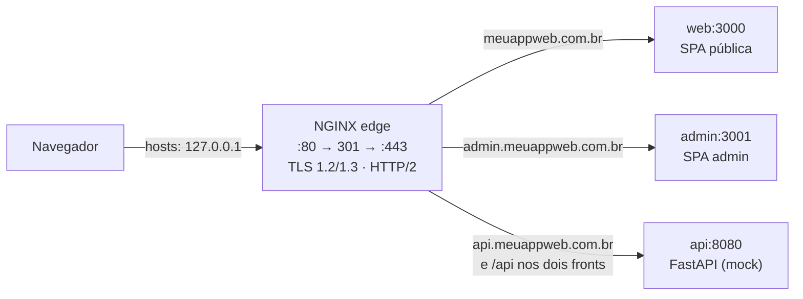

# MeuApp Eventos: NGINX + Docker Compose + HTTPS local

Exemplo prático para desenvolvimento local com NGINX de forma Segura.

Com um `git clone`, uma alteração no arquivo **hosts** e um `docker compose up`, você tem três aplicações em domínios "de verdade", com **HTTPS**, sem nenhuma porta na URL:

| URL | Serviço | Container (porta interna) |
|---|---|---|
| https://meuappweb.com.br | Frontend público (SPA da agenda de eventos) | `web:3000` |
| https://api.meuappweb.com.br | Backend FastAPI com dados mockados | `api:8080` |
| https://admin.meuappweb.com.br | Painel administrativo (SPA) | `admin:3001` |

Só o NGINX publica portas no host (80 e 443). Os outros containers ficam isolados na rede interna do Compose e só são acessíveis pelo proxy reverso.



---

## Pré-requisitos

- Docker com Docker Compose v2 (Docker Desktop no Windows/macOS)
- Portas **80** e **443** livres no host (no Windows, verifique IIS, Skype e outros proxies)

## Passo a passo

### 1. Clonar

```bash
git clone https://github.com/<seu-usuario>/nginx-meuappweb.git
cd nginx-meuappweb
```

### 2. Editar o arquivo hosts

O arquivo hosts tem precedência sobre o DNS, então os domínios passam a apontar para a sua máquina.

**Linux / macOS / WSL**
```bash
sudo ./scripts/hosts.sh add
```

**Windows** (PowerShell **como Administrador**)
```powershell
Set-ExecutionPolicy -Scope Process Bypass
.\scripts\hosts.ps1 add
```

<details>
<summary>Ou edite manualmente</summary>

Arquivo: `/etc/hosts` (Linux/macOS) ou `C:\Windows\System32\drivers\etc\hosts` (Windows)

```
127.0.0.1   meuappweb.com.br
127.0.0.1   www.meuappweb.com.br
127.0.0.1   api.meuappweb.com.br
127.0.0.1   admin.meuappweb.com.br
```
</details>

> ⚠️ Enquanto essas linhas existirem, `meuappweb.com.br` sempre abrirá a sua máquina, mesmo que o domínio exista na internet. Ao terminar, rode `hosts.sh remove` / `hosts.ps1 remove`.

### 3. Subir

```bash
docker compose up -d --build
```

Na primeira execução, o serviço `certgen` cria em `nginx/certs/` uma **CA local**, um certificado com SAN para os quatro domínios e o `dhparam.pem` de 2048 bits (leva alguns segundos). Nas execuções seguintes ele reaproveita os arquivos.

### 4. Confiar na CA local (para o cadeado verde)

Sem este passo tudo funciona, mas o navegador mostra um aviso de certificado. Importe **uma vez** o arquivo `nginx/certs/ca.crt`:

| Sistema | Comando |
|---|---|
| Windows (PowerShell) | `Import-Certificate -FilePath nginx\certs\ca.crt -CertStoreLocation Cert:\CurrentUser\Root` |
| macOS | `sudo security add-trusted-cert -d -r trustRoot -k /Library/Keychains/System.keychain nginx/certs/ca.crt` |
| Ubuntu/Debian | `sudo cp nginx/certs/ca.crt /usr/local/share/ca-certificates/meuappweb-ca.crt && sudo update-ca-certificates` |
| Firefox | Configurações → Privacidade e Segurança → Certificados → Ver certificados → Autoridades → Importar |

Depois, reinicie o navegador.

> 💡 Prefere o [mkcert](https://github.com/FiloSottile/mkcert)? Rode `mkcert -install` e
> `mkcert -cert-file nginx/certs/meuappweb.com.br.crt -key-file nginx/certs/meuappweb.com.br.key meuappweb.com.br www.meuappweb.com.br api.meuappweb.com.br admin.meuappweb.com.br`,
> depois `cat nginx/certs/meuappweb.com.br.crt "$(mkcert -CAROOT)/rootCA.pem" > nginx/certs/fullchain.pem` e suba o compose (o `certgen` só cria o que estiver faltando).

### 5. Acessar

- https://meuappweb.com.br: agenda de eventos com inscrição. Abra também **/diagnostico** para ver o que o backend recebe.
- https://admin.meuappweb.com.br: painel admin (usuário `admin`, senha `admin123`)
- https://api.meuappweb.com.br/docs: Swagger da API

### 6. Testar

```bash
./scripts/smoke-test.sh        # roteamento, redirects, headers, TLS e cache (não precisa do hosts)
./scripts/test-rate-limit.sh   # mostra o NGINX devolvendo HTTP 429 no login
```

No Windows, rode os scripts `.sh` pelo Git Bash ou pelo WSL.

---

## O que o e-book ensina e onde está no código

| Tema do e-book | Onde ver |
|---|---|
| Contextos `main` › `events` › `http` › `server` › `location` | [`nginx/nginx.conf`](nginx/nginx.conf) |
| Convenção `conf.d` (um arquivo por site) | [`nginx/conf.d/`](nginx/conf.d) |
| Arquivo hosts + domínios customizados | [`scripts/hosts.sh`](scripts/hosts.sh), [`scripts/hosts.ps1`](scripts/hosts.ps1) |
| Proxy reverso preservando headers (`X-Forwarded-*`, `Host`) | [`nginx/snippets/proxy.conf`](nginx/snippets/proxy.conf) + página `/diagnostico` |
| WebSocket (HMR) via `Upgrade`/`Connection` | [`nginx/snippets/proxy.conf`](nginx/snippets/proxy.conf) |
| **Fim do CORS** com same-origin (`/api` no mesmo domínio) | `location /api/` em [`10-web.conf`](nginx/conf.d/10-web.conf) e [`30-admin.conf`](nginx/conf.d/30-admin.conf) |
| SPA com `try_files` | [`web/nginx.conf`](web/nginx.conf), [`admin/nginx.conf`](admin/nginx.conf) |
| gzip + cache imutável de assets versionados | [`nginx/nginx.conf`](nginx/nginx.conf), [`web/nginx.conf`](web/nginx.conf) |
| Load balancing `upstream` + `least_conn` + `keepalive` | bloco `upstream api_upstream` em [`nginx/nginx.conf`](nginx/nginx.conf) |
| TLS 1.2/1.3, cifras AEAD, Forward Secrecy, `dhparam`, session cache | [`nginx/snippets/ssl.conf`](nginx/snippets/ssl.conf) |
| Headers de segurança (HSTS, X-Frame-Options, nosniff, Referrer-Policy, CSP) | [`nginx/snippets/security-headers.conf`](nginx/snippets/security-headers.conf), `csp-*.conf` |
| Herança de `add_header` (armadilha clássica) | `location` de `/docs` em [`20-api.conf`](nginx/conf.d/20-api.conf) |
| `server_tokens off`, `client_max_body_size`, timeouts anti-Slowloris | [`nginx/nginx.conf`](nginx/nginx.conf) |
| Redirecionamento 301 HTTP → HTTPS e www → apex | [`00-default.conf`](nginx/conf.d/00-default.conf), [`10-web.conf`](nginx/conf.d/10-web.conf) |
| Rate limiting (Leaky Bucket) + HTTP 429 | `limit_req_zone` em `nginx.conf`, `limit_req` nos sites |
| Rejeitar hosts desconhecidos (`444` / `ssl_reject_handshake`) | [`00-default.conf`](nginx/conf.d/00-default.conf) |

### Experimentos sugeridos

**Ver o load balancing em ação**
```bash
docker compose up -d --scale api=3
docker compose restart nginx          # o NGINX resolve os nomes do upstream na inicialização
for i in $(seq 1 6); do curl -s --cacert nginx/certs/ca.crt https://api.meuappweb.com.br/health; echo; done
```
O campo `instance` (e o header `X-Api-Instance`) mostra qual réplica respondeu. Como os dados ficam em memória, cada réplica tem as próprias inscrições.

**Validar e recarregar sem downtime**
```bash
docker compose exec nginx nginx -t
docker compose exec nginx nginx -s reload
```

**Ver os headers de segurança**
```bash
curl -sI --cacert nginx/certs/ca.crt https://meuappweb.com.br
```

---

## Estrutura

```
.
├── docker-compose.yml
├── nginx/                     # NGINX de borda (edge)
│   ├── nginx.conf             # main/events/http, gzip, rate limit, upstreams
│   ├── conf.d/                # um arquivo por site
│   │   ├── 00-default.conf    # 80→443, catch-all 444, reject handshake
│   │   ├── 10-web.conf        # meuappweb.com.br (+ www → apex)
│   │   ├── 20-api.conf        # api.meuappweb.com.br
│   │   └── 30-admin.conf      # admin.meuappweb.com.br
│   ├── snippets/              # ssl, headers de segurança, CSPs, proxy
│   └── certs/                 # gerado pelo certgen (ignorado no git)
├── web/                       # SPA pública já "buildada" (HTML/CSS/JS puros)
├── admin/                     # SPA administrativa já "buildada"
├── api/                       # FastAPI + dados mockados
└── scripts/                   # certificados, hosts e testes
```

As SPAs foram escritas em JavaScript puro, sem dependências, para que o foco fique no NGINX. Os arquivos em `public/` já são o "build" final. Se você trocar por React/Vue/Angular, basta copiar o `dist/` para `public/`. O `try_files` e o cache dos assets continuam funcionando, porque esses frameworks já geram arquivos com hash no nome.

## Diferenças intencionais para produção

| Item | Aqui (dev local) | Em produção |
|---|---|---|
| Certificado | CA local gerada pelo `certgen` | Let's Encrypt/Certbot com renovação automática |
| HSTS | `max-age=300` (5 min) | `max-age=63072000; includeSubDomains` (considere `preload`) |
| OCSP Stapling | desligado (CA local não tem OCSP) | `ssl_stapling on; ssl_stapling_verify on;` |
| Painel admin | aberto | restrito por `allow/deny`, VPN ou SSO |
| Login | usuário/senha fixos no compose | identidade real + segredos fora do repositório |

O HSTS curto é proposital. Se você remover a CA local, um HSTS de 1 ano faria o navegador bloquear o domínio sem opção de "continuar mesmo assim".

## Solução de problemas

- **`bind: address already in use` na 80/443**: outro serviço ocupa a porta. Pare-o ou troque o mapeamento em `docker-compose.yml` (por exemplo, `8443:443`, e acesse `https://meuappweb.com.br:8443`).
- **O navegador ainda abre o site real**: limpe o cache de DNS (`ipconfig /flushdns` no Windows, `sudo dscacheutil -flushcache; sudo killall -HUP mDNSResponder` no macOS) e confira se o navegador não usa "DNS seguro" (DoH), que ignora o hosts em alguns casos.
- **`sh: gen-certs.sh: not found` ou `\r` nos logs do certgen**: o git converteu os scripts para CRLF. O `.gitattributes` evita isso em clones novos. Para corrigir, rode `git rm --cached -r . && git reset --hard`.
- **Recriar os certificados**: apague o conteúdo de `nginx/certs/` (menos o `.gitkeep`) e rode `docker compose up -d` de novo.

## Limpeza

```bash
docker compose down --rmi local
sudo ./scripts/hosts.sh remove        # ou .\scripts\hosts.ps1 remove no Windows
```
Remova também a CA local do repositório de certificados do sistema, se você a importou.
